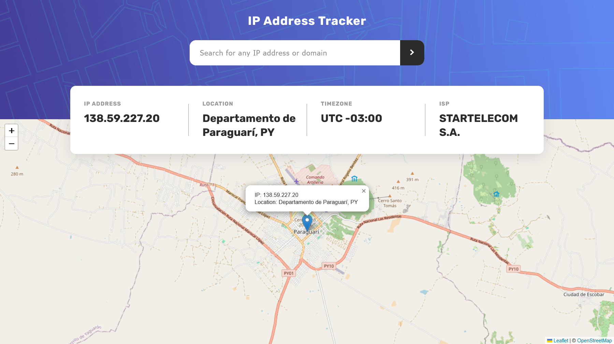
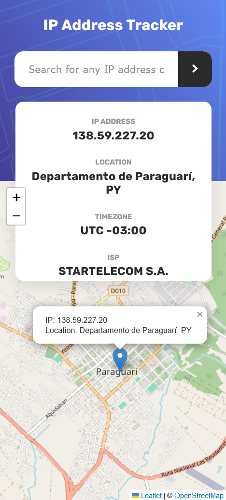

# Frontend Mentor - IP address tracker solution

Este proyecto es una de los varios desafíos de frontend realizados en la pataforma "fronend mentor"
[Perfil Aquí](https://www.frontendmentor.io/profile/uvdevelop26). Puedes visitar mi perfil y revisar mis proyectos hasta la fecha.

This is a solution to the [IP address tracker challenge on Frontend Mentor](https://www.frontendmentor.io/challenges/ip-address-tracker-I8-0yYAH0). Frontend Mentor challenges help you improve your coding skills by building realistic projects.

## Table of contents

- [Overview](#overview)
  - [The challenge](#the-challenge)
  - [Screenshot](#screenshot)
  - [Links](#links)
- [My process](#my-process)
  - [Built with](#built-with)
  - [What I learned](#what-i-learned)
- [Author](#author)
- [Acknowledgments](#acknowledgments)

## Overview

### The challenge

Users should be able to:

- View the optimal layout for each page depending on their device's screen size
- See hover states for all interactive elements on the page
- See their own IP address on the map on the initial page load
- Search for any IP addresses or domains and see the key information and location

### Screenshot




### Links

- Solution URL: [Github](https://github.com/uvdevelop26/ip-address-tracker-master)
- Live Site URL: [Github Pages](https://uvdevelop26.github.io/ip-address-tracker-master/)

## My process

### Built with

- Semantic HTML5 markup
- SASS
- Flexbox
- Mobile-first workflow

### What I learned

I have worked with API calls before using the Fetch API. In this challenge, I learned how to set up and manipulate maps, which was a lot of fun. I enjoyed using Leaflet and exploring its features.

```js

const map = L.map("map").setView([51.505, -0.09], 13);
L.tileLayer("https://tile.openstreetmap.org/{z}/{x}/{y}.png", {
  maxZoom: 19,
  attribution:
    '&copy; <a href="http://www.openstreetmap.org/copyright">OpenStreetMap</a>',
}).addTo(map);

```


## Author

- Portfolio Web - (https://porfolio-uvbusiness.netlify.app/)
- Frontend Mentor - [@uvdevelop26](https://www.frontendmentor.io/profile/uvdevelop26)
- Instagram - [@uvbusiness24](https://www.instagram.com/uvbusiness24/)

